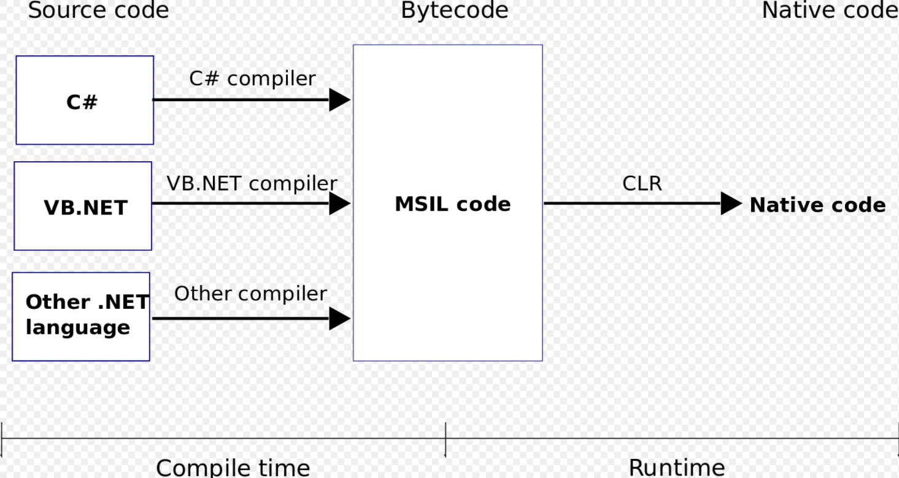

# CLR / Common Language Runtime / 通用語言執行平台

## What

> 開發人員使用高階程式語言撰寫程式。接下來編譯器將程式碼編譯成微軟的中繼語言(MSIL)。執行的時候CLR會將MSIL碼轉換為作業系統的原生碼（Native code）。

## Why

> CLR的主要功能如下
>
> 1. 基礎類別庫支援 Base Class Library Support
> 1. 記憶體管理 Memory Management
> 1. 執行緒管理 Thread Management
> 1. 垃圾回收 Garbage Collection
> 1. 安全性 Security
> 1. 類型檢查 Type Checker
> 1. 異常管理 Exception Manager
> 1. 除錯管理 Debug Engine
> 1. 中間碼(MSIL)到機器碼(Native)編譯
> 1. 類別裝載 Class Loader

## 參考資料

* 通用語言運行庫
  * https://zh.wikipedia.org/wiki/%E9%80%9A%E7%94%A8%E8%AA%9E%E8%A8%80%E9%81%8B%E8%A1%8C%E5%BA%AB
